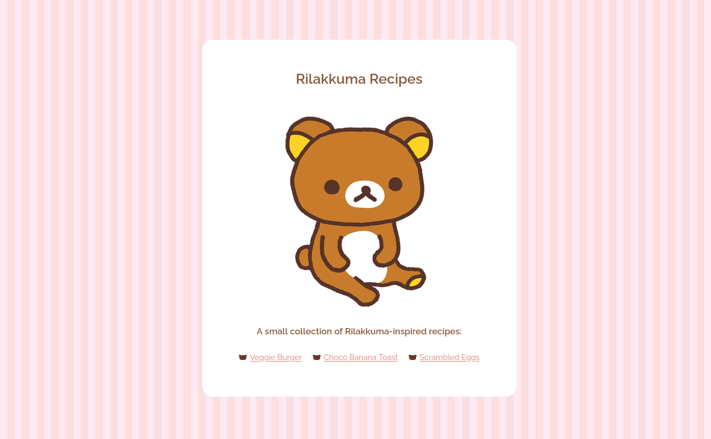
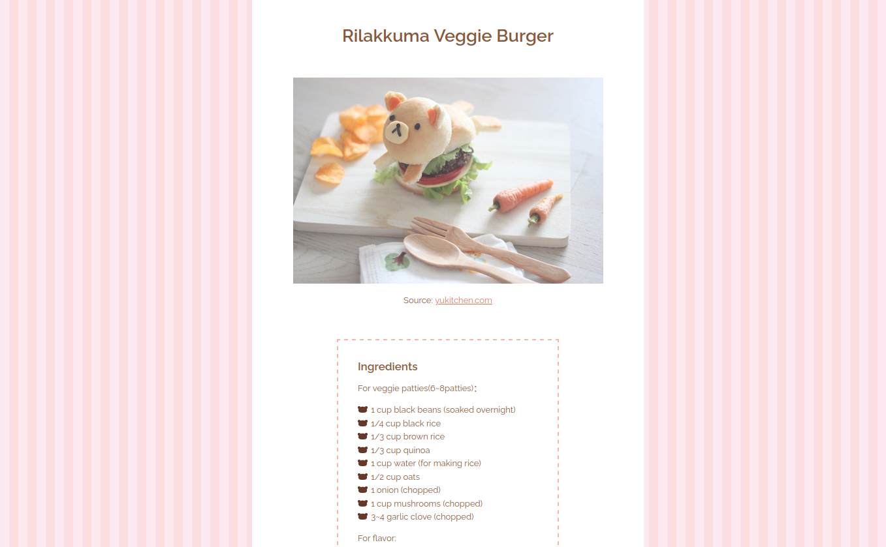

# The Odin Project - Project: Recipes solution

This is a solution to the [Project: Recipes assignment on the Odin Project](https://www.theodinproject.com/paths/foundations/courses/foundations/lessons/recipes#assignment). The Odin Project provides a free open source coding curriculum that can be taken entirely online.

### The assignment

- Build a basic recipe website
- The website will consist of a main index page which will have links to a few recipes
- For practice, add some CSS to it and use the external method

### Screenshots

### Sources:

- Photographs and recipes used in this assignment are by [Yukitchen](http://yukitchen.com/).